# Create IBM Container Registry 

Create Registry namespaces and expose the API Keys to acess the registry by using the below steps.

### 1. Create Registry Namespace

Create Registry namespace in `Tokyo` region.

Note the registry is created in an account called `IBM-JeyaGandhi`.

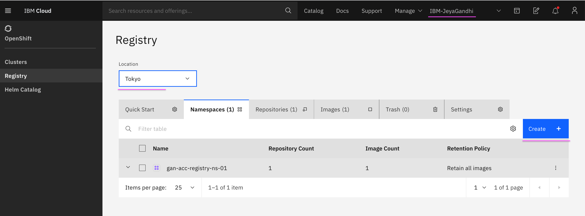
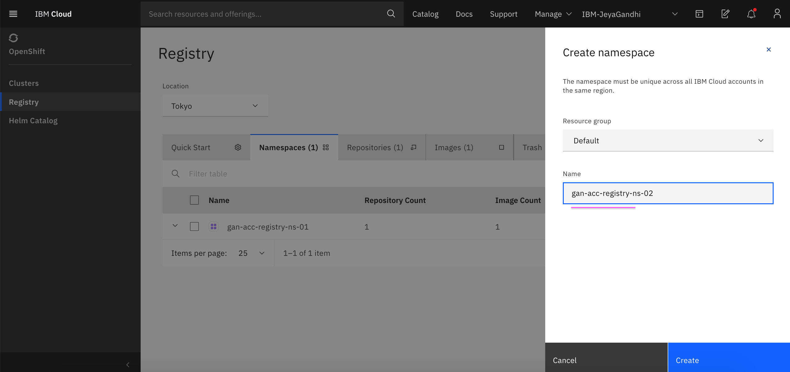
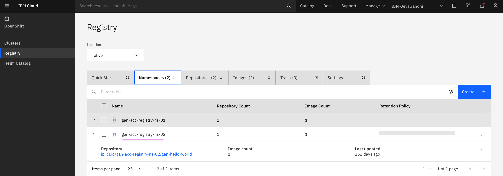

### 2. Create Service Id 

Create Service Id for container registry.

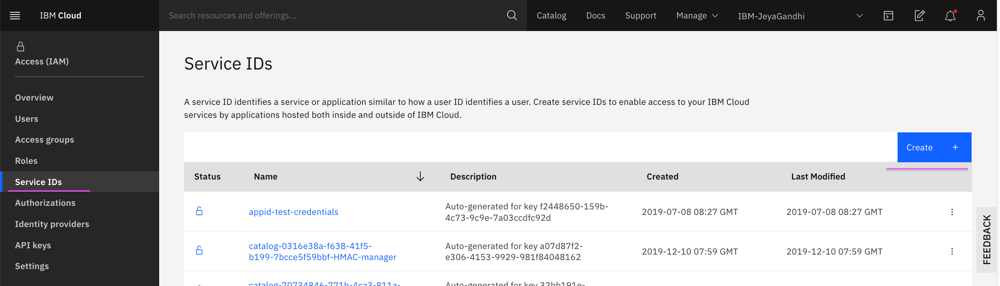
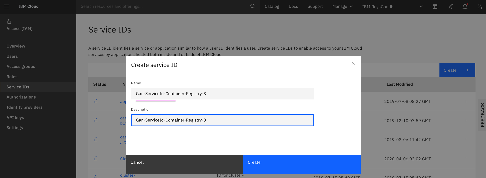
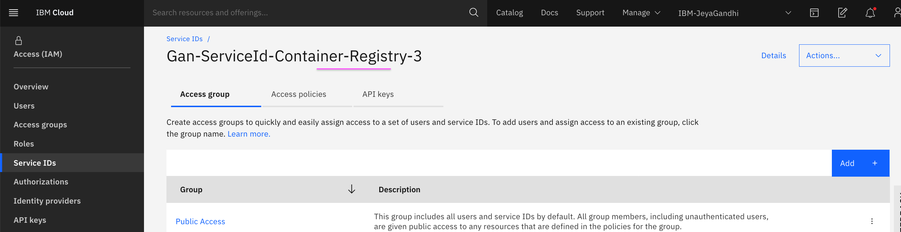

### 3. Create API Keys

Create API Keys for Service Id.

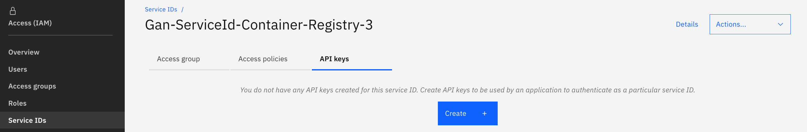
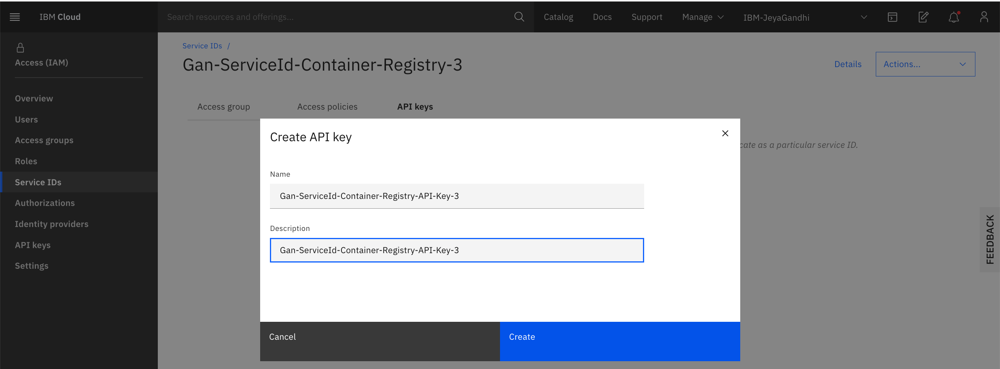
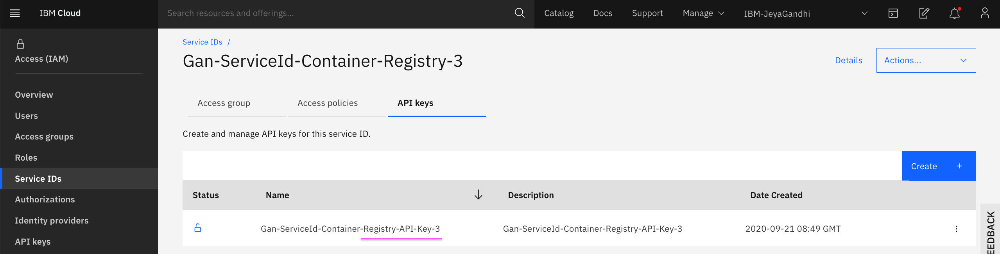

### 4. Assign access policy

Assign access policy for Service Id.

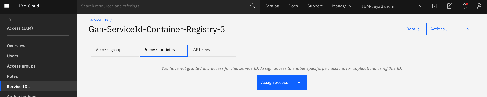
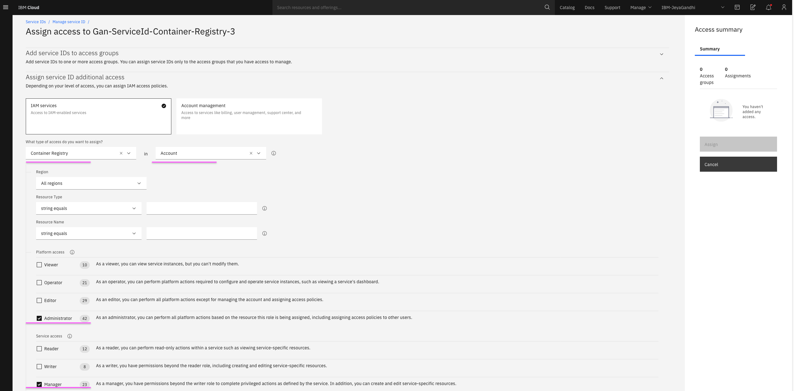
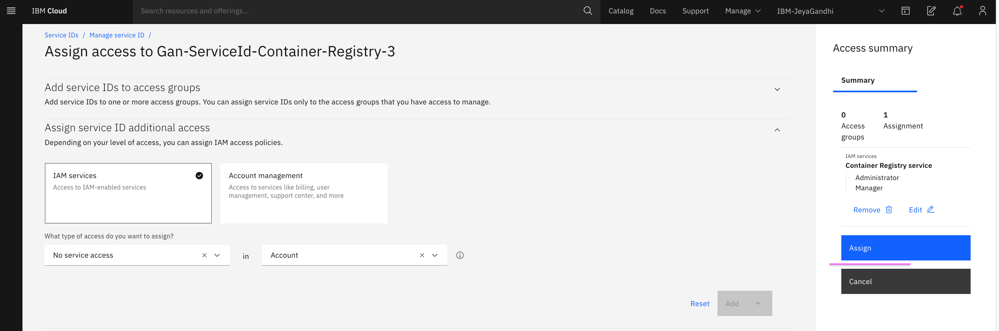
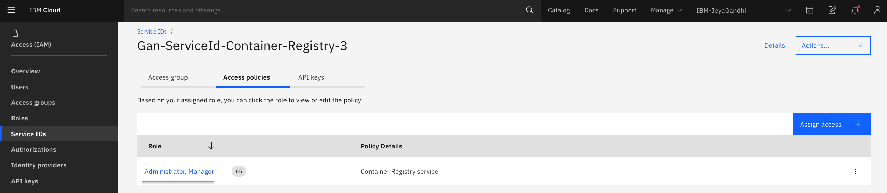

### 4. Registry images

Here are the registry images available as of now

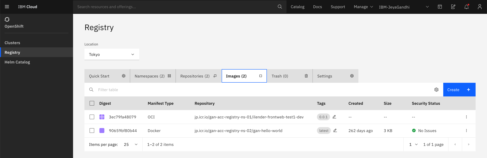
