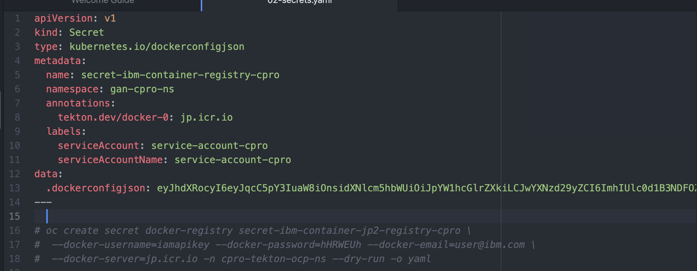
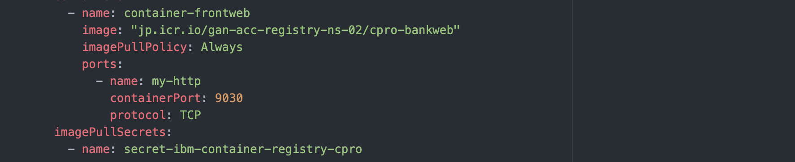

# An application using Docker Image from IBM Container Registry.

An application image is available in IBM container Registry.

This application is going to be deployed in OCP cluster residing in different IBM cloud account.

Still the application is able to access the image.

### 1. Create Container Registry

Refer : [Create Container Registry](../01-create-container-registry) 

### 2. Push Image to Registry

Refer : [Push Image to Registry](../02-push-image-to-registry) 

### 3. App Configuration for accessing Container registry 

1. Create docker secret with API Keys to access container registry.



2. Refer the docker secret in the `imagePullSecrets`.



### 4. Install the app

Install this app in OCP cluster residing in different account, not in the same account where container registry is there.

1. Goto to the folder `install`

2. Run the command 

```
sh 01-install.sh
```

3. Access the Application

Access the applicaiton using the 'Routes' created under 'gan-cpro-ns'

